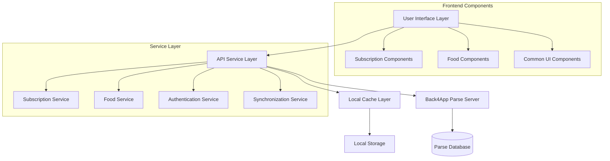

# Design Document - Back4App CRUD Management System

## Overview

This design document outlines the architecture and implementation approach for a comprehensive CRUD (Create, Read, Update, Delete) management system built on Back4App cloud database. The system manages two primary entities: Subscriptions and Food items, providing real-time data synchronization, robust error handling, and intuitive user interfaces.

The system leverages Back4App's Parse Server infrastructure to provide scalable, secure, and reliable data operations while maintaining a responsive user experience through optimistic updates and intelligent caching strategies.

## Architecture

### High-Level Architecture



### Component Architecture

The system follows a layered architecture pattern:

1. **Presentation Layer**: React/Preact components for user interaction
2. **Service Layer**: Business logic and API communication
3. **Data Layer**: Back4App integration and local caching
4. **Synchronization Layer**: Real-time updates and conflict resolution

## Components and Interfaces

### Core Services

#### Back4AppClient
```typescript
interface Back4AppClient {
  initialize(appId: string, serverUrl: string): Promise<void>
  authenticate(credentials: AuthCredentials): Promise<User>
  query<T>(className: string, query: QueryOptions): Promise<T[]>
  create<T>(className: string, data: Partial<T>): Promise<T>
  update<T>(className: string, id: string, data: Partial<T>): Promise<T>
  delete(className: string, id: string): Promise<void>
  subscribe(className: string, callback: (data: any) => void): Subscription
}
```

#### SubscriptionService
```typescript
interface SubscriptionService {
  getAllSubscriptions(): Promise<Subscription[]>
  createSubscription(data: CreateSubscriptionRequest): Promise<Subscription>
  updateSubscription(id: string, data: UpdateSubscriptionRequest): Promise<Subscription>
  deleteSubscription(id: string): Promise<void>
  searchSubscriptions(query: string): Promise<Subscription[]>
}
```

#### FoodService
```typescript
interface FoodService {
  getAllFoods(): Promise<Food[]>
  createFood(data: CreateFoodRequest): Promise<Food>
  updateFood(id: string, data: UpdateFoodRequest): Promise<Food>
  deleteFood(id: string): Promise<void>
  getFoodsNearExpiry(days: number): Promise<Food[]>
  searchFoods(query: string): Promise<Food[]>
}
```

### UI Components

#### CRUDTable Component
```typescript
interface CRUDTableProps<T> {
  data: T[]
  columns: ColumnDefinition<T>[]
  onEdit: (item: T) => void
  onDelete: (id: string) => void
  onCreate: () => void
  loading: boolean
  error?: string
}
```

#### FormModal Component
```typescript
interface FormModalProps<T> {
  isOpen: boolean
  mode: 'create' | 'edit'
  initialData?: Partial<T>
  fields: FieldDefinition[]
  onSubmit: (data: T) => Promise<void>
  onClose: () => void
  validationSchema: ValidationSchema
}
```

## Data Models

### Subscription Model
```typescript
interface Subscription {
  id: string
  name: string
  category: string
  url: string
  price: number
  currency: string
  nextPayment: Date
  billingCycle: 'monthly' | 'yearly' | 'weekly'
  status: 'active' | 'paused' | 'cancelled'
  createdAt: Date
  updatedAt: Date
}
```

### Food Model
```typescript
interface Food {
  id: string
  name: string
  brand?: string
  quantity: number
  unit: string
  price?: number
  currency: string
  expiryDate: Date
  category: string
  status: 'fresh' | 'near_expiry' | 'expired' | 'consumed'
  location?: string
  createdAt: Date
  updatedAt: Date
}
```

### API Request/Response Models
```typescript
interface CreateSubscriptionRequest {
  name: string
  category: string
  url: string
  price: number
  currency: string
  nextPayment: Date
  billingCycle: 'monthly' | 'yearly' | 'weekly'
}

interface CreateFoodRequest {
  name: string
  brand?: string
  quantity: number
  unit: string
  price?: number
  currency: string
  expiryDate: Date
  category: string
  location?: string
}
```

## Correctness Properties

*A property is a characteristic or behavior that should hold true across all valid executions of a system-essentially, a formal statement about what the system should do. Properties serve as the bridge between human-readable specifications and machine-verifiable correctness guarantees.*

### Property Reflection

After reviewing all identified properties, several can be consolidated to eliminate redundancy:

- **Connection and Authentication Properties (1.1-1.5)** can be combined into a comprehensive connection management property
- **Success Flow Properties (2.3, 3.3, 4.3, 5.3, 6.3, 8.3, 9.3)** share similar patterns and can be consolidated
- **Error Handling Properties (2.5, 4.5, 5.5, 6.5, 8.5, 9.5)** follow the same pattern and can be unified
- **Form Population Properties (4.1, 8.1)** are essentially the same behavior for different entities

### Core Properties

**Property 1: Back4App Connection Management**
*For any* application startup or reconnection attempt, the system should establish secure connection with proper authentication and handle failures gracefully with retry mechanisms
**Validates: Requirements 1.1, 1.2, 1.3, 1.4, 1.5**

**Property 2: CRUD Operation Success Flow**
*For any* successful CRUD operation (create, update, delete), the system should display appropriate success messages and refresh the relevant data display
**Validates: Requirements 2.3, 4.3, 5.3, 6.3, 8.3, 9.3**

**Property 3: Data Creation Consistency**
*For any* valid data submission (subscription or food), the system should create corresponding Parse_Object in Back4App and reflect changes in the UI
**Validates: Requirements 2.2, 6.2**

**Property 4: Data Update Consistency**
*For any* valid data modification (subscription or food), the system should update corresponding Parse_Object in Back4App and reflect changes in the UI
**Validates: Requirements 4.2, 8.2**

**Property 5: Data Deletion Consistency**
*For any* confirmed deletion request (subscription or food), the system should remove Parse_Object from Back4App and update the UI accordingly
**Validates: Requirements 5.2, 9.2**

**Property 6: Form Validation and Error Prevention**
*For any* invalid or incomplete form data, the system should prevent submission, highlight problematic fields, and provide clear error messages
**Validates: Requirements 2.4, 4.4**

**Property 7: API Error Handling and Recovery**
*For any* API operation failure, the system should display appropriate error messages, preserve user input/state, and provide recovery options
**Validates: Requirements 2.5, 4.5, 5.5, 6.5, 8.5, 9.5**

**Property 8: Data Loading and Display**
*For any* data fetch operation, the system should show loading indicators during processing and display results in organized format when complete
**Validates: Requirements 3.2, 3.3, 7.2, 7.3**

**Property 9: Search and Filter Functionality**
*For any* search query input, the system should filter displayed records in real-time and highlight matching text appropriately
**Validates: Requirements 10.1, 10.2, 10.4**

**Property 10: Form Population for Editing**
*For any* edit operation, the system should populate forms with current data accurately for both subscriptions and food items
**Validates: Requirements 4.1, 8.1**

**Property 11: Expiry Date Highlighting**
*For any* food items with expiry dates, the system should highlight items near expiry with appropriate warning colors based on remaining days
**Validates: Requirements 7.4**

**Property 12: Retry and Backoff Strategy**
*For any* API timeout or failure, the system should implement exponential backoff retry strategy and handle network unavailability gracefully
**Validates: Requirements 11.1, 11.3**

**Property 13: Error Mapping and User Feedback**
*For any* server validation errors, the system should map errors to specific form fields and provide clear user feedback
**Validates: Requirements 11.2, 11.4**

**Property 14: Data Synchronization**
*For any* data refresh or sync operation, the system should fetch latest data from server and handle conflicts using server data as authoritative source
**Validates: Requirements 12.2, 12.3, 12.4, 12.5**

**Property 15: Cancellation Flow Preservation**
*For any* cancellation action (delete confirmation, form close), the system should maintain current state without making changes
**Validates: Requirements 5.4, 9.4**

## Error Handling

### Error Categories and Strategies

1. **Network Errors**
   - Connection timeouts: Exponential backoff retry
   - Network unavailable: Queue operations for later execution
   - Server unreachable: Display offline mode with cached data

2. **Validation Errors**
   - Client-side validation: Immediate feedback with field highlighting
   - Server-side validation: Map errors to specific fields
   - Data conflicts: Prompt user for resolution

3. **Authentication Errors**
   - Token expiry: Automatic refresh with fallback to re-login
   - Permission denied: Clear error messages with suggested actions
   - Invalid credentials: Secure error handling without exposing details

4. **Data Integrity Errors**
   - Concurrent modifications: Use server data as authoritative source
   - Missing references: Graceful degradation with user notification
   - Schema mismatches: Version compatibility checks

### Error Recovery Mechanisms

```typescript
interface ErrorRecoveryStrategy {
  retryable: boolean
  maxRetries: number
  backoffStrategy: 'linear' | 'exponential'
  fallbackAction?: () => void
  userNotification: string
}
```

## Testing Strategy

### Dual Testing Approach

The system will implement both unit testing and property-based testing to ensure comprehensive coverage:

**Unit Testing:**
- Specific examples demonstrating correct behavior
- Integration points between components
- Edge cases and error conditions
- UI component interactions

**Property-Based Testing:**
- Universal properties that should hold across all inputs
- Data consistency across CRUD operations
- Error handling behavior verification
- API communication reliability

**Property-Based Testing Framework:**
- **Framework**: fast-check for TypeScript/JavaScript
- **Configuration**: Minimum 100 iterations per property test
- **Tagging**: Each property test tagged with format: `**Feature: back4app-crud-management, Property {number}: {property_text}**`

**Testing Requirements:**
- Each correctness property must be implemented by a single property-based test
- Unit tests complement property tests by covering specific scenarios
- Integration tests verify end-to-end workflows
- Performance tests ensure acceptable response times under load

### Test Data Generation

Property-based tests will use intelligent generators that:
- Generate valid subscription and food data within realistic constraints
- Create edge cases for dates, quantities, and string lengths
- Simulate various error conditions and network states
- Test concurrent operations and race conditions

### Mocking Strategy

- **Back4App API**: Mock Parse Server responses for consistent testing
- **Network Conditions**: Simulate various network states and failures
- **User Interactions**: Mock user inputs and UI events
- **Time-based Operations**: Control time for expiry date testing